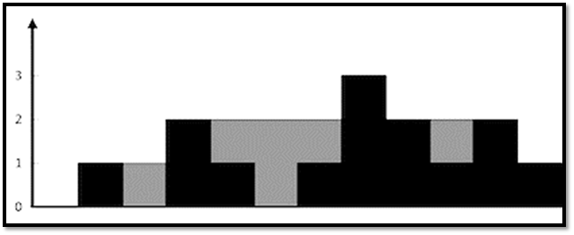

# Question:

Given `n` non-negative integers representing an elevation map where the width of each bar is 1, compute how much water it can trap after raining.

## Example 1:

 
Input: ` height = [0,1,0,2,1,0,1,3,2,1,2,1] `  
Output: 6  
Explanation:  
The above elevation map (black section) is represented by array ` [0,1,0,2,1,0,1,3,2,1,2,1] `. In this case, 6 units of rain water (grey section) are being trapped.

## Example 2:
Input: ` height = [4,2,0,3,2,5] `  
Output: 9
